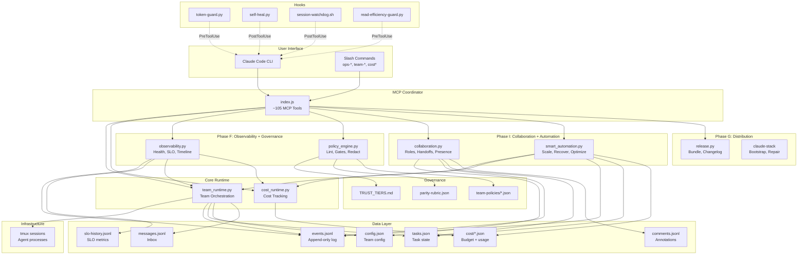

# Architecture — Claude Parity Layer

## System Diagram



## Data Flow

```
User Request
  → Slash Command / MCP Tool Call
    → Coordinator (index.js)
      → Python Script (execFileSync)
        → Read/Write JSON/JSONL files
        → Execute subprocess (tmux, ccusage)
      → Return text/JSON result
    → Display to user
```

### Event Flow
```
Action → team_runtime.py appends to events.jsonl
  → observability.py reads events for:
      - Health report (aggregate counts)
      - Timeline (chronological view)
      - SLO metrics (latency, rates)
      - Audit trail (filtered by type)
  → smart_automation.py reads events for:
      - Auto-recover (failure/restart counts)
      - Auto-scale (queue depth)
      - Weekly optimize (7-day analysis)
```

### Hook Flow
```
PreToolUse:
  token-guard.py → enforces agent limits, token budgets
  read-efficiency-guard.py → prevents excessive sequential reads

PostToolUse:
  self-heal.py → auto-repairs config drift
  session-watchdog.sh → detects hung sessions
  agent-lifecycle.sh → tracks agent metrics
```

## File Layout

```
~/.claude/
├── scripts/
│   ├── team_runtime.py          # Core orchestration
│   ├── cost_runtime.py          # Cost tracking
│   ├── observability.py         # Health + SLO
│   ├── policy_engine.py         # Governance
│   ├── collaboration.py         # Multi-human
│   ├── smart_automation.py      # Automation
│   ├── release.py               # Distribution
│   └── claude-stack             # CLI wrapper
├── mcp-coordinator/
│   └── index.js                 # MCP tool gateway
├── hooks/
│   ├── token-guard.py           # Agent limits
│   ├── self-heal.py             # Auto-repair
│   └── ...
├── governance/
│   ├── TRUST_TIERS.md           # Trust policy
│   ├── parity-rubric.json       # Grading rubric
│   └── team-policies/           # Per-team policies
├── cost/
│   ├── budgets.json             # Budget limits
│   ├── config.json              # Cost config
│   └── cache.json               # Usage data
├── teams/{id}/
│   ├── config.json              # Team config
│   ├── tasks.json               # Task state
│   ├── events.jsonl             # Event log
│   ├── messages.jsonl           # Inbox
│   ├── comments.jsonl           # Annotations
│   └── handoffs/                # Handoff snapshots
├── reports/
│   ├── slo-history.jsonl        # SLO metrics
│   └── weekly-optimize-*.md     # Optimization reports
├── commands/
│   ├── ops-*.md                 # Ops slash commands
│   ├── team-*.md                # Team slash commands
│   └── cost*.md                 # Cost slash commands
├── docs/
│   ├── operator-manual.md       # This manual
│   ├── incident-runbooks.md     # Incident response
│   ├── architecture.md          # This diagram
│   ├── config-reference.md      # Config schemas
│   └── troubleshooting.md       # Symptom → fix
└── distribution/
    ├── manifest.json            # Bundle manifest
    └── compatibility.md         # Platform compat
```
