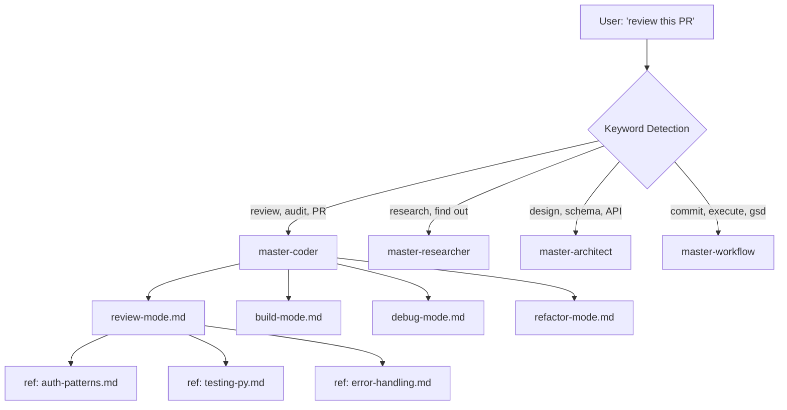

# Claude Master Agents

A framework of specialized AI agents for Claude Code with automatic task detection and mode routing. Four master agents cover coding, research, architecture, and workflow — each with domain-specific modes and reference cards.

## How It Works



1. User says something like "review this PR" or "fix the login bug"
2. CLAUDE.md trigger rules detect keywords and select the right master agent
3. The agent loads its mode file (e.g., `review-mode.md`) with specialized instructions
4. Mode files reference domain-specific cards (e.g., `refs/auth-patterns.md`) as needed

## The Four Master Agents

| Agent | Modes | Ref Cards | Triggers |
|-------|-------|-----------|----------|
| **master-coder** | build, debug, review, refactor | 14 (auth, testing, design, error handling, git, JS/TS, Python, etc.) | "build/create/implement", "fix/debug/error", "review/audit/PR", "simplify/refactor" |
| **master-researcher** | academic, market, technical, general | — | "research/find out", "competitor/market", "paper/study", "docs/how to use" |
| **master-architect** | database, api, system, frontend | 1 (sql-optimization) | "design/architect/schema", "database/SQL", "API/REST/GraphQL", "system design" |
| **master-workflow** | gsd-exec, feature, git, autonomous | — | "/gsd:", "commit/push/PR", "new feature", "autonomous/vibe code" |

## Directory Structure

```
claude-master-agents/
├── master-agents/
│   ├── coder/
│   │   ├── build-mode.md       # Autonomous feature development
│   │   ├── debug-mode.md       # Systematic debugging
│   │   ├── review-mode.md      # 7-dimension code review
│   │   ├── refactor-mode.md    # Code simplification
│   │   └── refs/               # 14 domain reference cards
│   │       ├── auth-patterns.md
│   │       ├── testing-py.md
│   │       ├── design-principles.md
│   │       └── ... (11 more)
│   ├── researcher/
│   │   ├── academic-mode.md
│   │   ├── market-mode.md
│   │   ├── technical-mode.md
│   │   └── general-mode.md
│   ├── architect/
│   │   ├── database-design.md
│   │   ├── api-design.md
│   │   ├── system-design.md
│   │   └── frontend-design.md
│   └── workflow/
│       ├── gsd-exec-mode.md
│       ├── feature-mode.md
│       ├── git-mode.md
│       └── autonomous-mode.md
├── commands/
│   └── gsd/                    # 6 core GSD commands
│       ├── new-project.md
│       ├── plan-phase.md
│       ├── execute-plan.md
│       ├── progress.md
│       ├── verify-work.md
│       ├── help.md
│       └── extras/             # 21 advanced commands
├── agents/                     # Agent definition files
├── examples/
│   ├── CLAUDE.example.md       # Template CLAUDE.md with dispatch rules
│   └── custom-mode.md          # How to write your own mode
└── README.md
```

## Installation

1. Copy the contents to your `~/.claude/` directory:

```bash
cp -r master-agents/ ~/.claude/master-agents/
cp -r commands/ ~/.claude/commands/
cp -r agents/ ~/.claude/agents/
```

2. Add the dispatch rules to your `~/.claude/CLAUDE.md` (see `examples/CLAUDE.example.md` for the full template).

## Adding Your Own Mode

Create a new `.md` file in any agent directory:

```markdown
# My Custom Mode — One-Line Description

You are an expert at [domain]. Follow this protocol exactly.

## Embedded Knowledge
- List the skills/knowledge this mode combines
- Reference any ref cards: "load refs/my-card.md when doing X"

## Protocol

### Phase 1: Understand
1. Read the task completely
2. Identify files that need to change
3. Check existing patterns

### Phase 2: Execute
1. Follow existing conventions
2. Write tests for new behavior
3. Verify everything works

## Rules
- Rule 1
- Rule 2
```

Then add a trigger to your CLAUDE.md:
```markdown
- **my-agent**: "keyword1/keyword2" (my-mode)
```

See `examples/custom-mode.md` for a complete annotated template.

## GSD Commands (Get Shit Done)

GSD creates hierarchical project plans optimized for solo agentic development.

### Core Commands

| Command | What It Does |
|---------|-------------|
| `/gsd:new-project` | Initialize a project with brief, config, and `.planning/` structure |
| `/gsd:plan-phase <n>` | Create a detailed execution plan for phase N |
| `/gsd:execute-plan <path>` | Execute a PLAN.md file with sequential task completion |
| `/gsd:progress` | Check project status, show progress bar, route to next action |
| `/gsd:verify-work` | Guide manual acceptance testing of recently built features |
| `/gsd:help` | Show the full command reference |

### Quick Workflow

```
/gsd:new-project          # Set up project brief
/gsd:plan-phase 1         # Plan first phase
/gsd:execute-plan .planning/phases/01-foundation/01-01-PLAN.md
/gsd:progress             # Check status, get next steps
```

21 additional advanced commands are available in `commands/gsd/extras/` for roadmap management, milestone tracking, debugging, todo management, and more.

## Token Management

The framework includes a token management system via CLAUDE.md rules:

| Level | Tool | Cost | When |
|-------|------|------|------|
| 1 | Grep/Read | ~1-5k | Know what you're looking for |
| 2 | Single agent (Sonnet) | ~40-60k | Need architecture understanding |
| 3 | 2 agents parallel | ~80-120k | Truly separate areas (rare) |
| 4 | Plan agent | ~30-50k | Architecture decisions |

The companion [claude-code-toolkit](https://github.com/DrewDawson2027/claude-code-toolkit) enforces these limits mechanically via the `token-guard.py` hook.

## License

MIT
